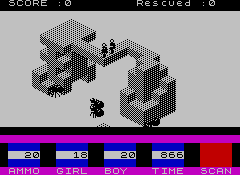
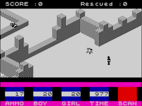
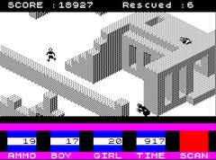

# Task 09-AntAttack
Your task is to implement a simple 3D cubic world rendering system resembling the old ZX Spectrum
game [Ant Attack](https://en.wikipedia.org/wiki/Ant_Attack) by Sandy White, Quicksilva.

  

(If you are interested in ancient game development technologies,
go to [this page](http://sandywhite.co.uk/fun/ants/))

The entire 3D scene ("the city") must be rendered interactively using the
[OpenGL library](https://www.opengl.org/) bound to the .NET through the
[Silk.NET library](https://github.com/dotnet/Silk.NET).

No need to use the original **isometric viewing system** (but the use of orthographic
projection is required). You need to keep the 3D scene made of **"axis-aligned" boxes**.

# Details
* Don't use any advanced shading, just assign **five colors/shades** to the
  five face orientations, plus one for the horizontal ground.
* Use the **orthographic view**, please.
* Use the mouse or keyboard to **rotate the view** around the vertical axis
  (you can use continuous rotation, not just four basic view directions like
  the original game)
* You can allow the **elevation angle** of the view to be set.
* Use **keyboard (WASD or arrows)** for moving your character through the city.
  Keep restricted directions of movement (north, west, south, east). 
* Allow your character to **jump** onto obstacles **one unit high** (no more).
  When jumping down, you can choose to either allow a jump from any height
  or penalize falls from higher heights.

## Game logic & bonuses
For bonus points you can implement some logic inspired by the original game:
* Control your character (boy or girl) and let him*her **find the other (lost)
  character** (girl or boy). No enemies (*level 1*).
* No **advanced rendering** of the characters is necessary. Think of a simple
  way to render a male and a female character.
* Implement simple and stupid **enemies** that will hurt you as soon as they get
  close. You can give them the ability to run as fast as you, or they can run
  a little faster. Again, don't worry about their appearance if you don't
  want to (*level 2*)
* **Time and health counters** (think about what reduces a character's health).
* It would probably be fair if you had some **defenses against the enemies**, e.g.
  throwing "grenades" from the original game seems like a good idea. Beware
  of the grenades - they can also hurt your characters! (*level 3*)
* **Micro-animations** for character movements (forward step, jump, fall),
  enemies (running, hurting your characters...), grenades (throwing, blowing up)...
* **Design interesting "cities"** from boxes. You can use the original idea -
  to encode occupied boxes by bits (the original city was no more than eight
  stories high, so **one byte** was used for one square of the floor plan. We can
  use 32-bit words today, which is our recommendation).
* You can try to design and implement some **different game logic**, e.g.
  discover hidden treasures, find the exit from the maze, etc.

# Sil.NET framework
It is easy to use the [Silk.NET](https://github.com/dotnet/Silk.NET) in your C#
program, you just install the [Silk.NET NuGet package](https://www.nuget.org/packages/Silk.NET/).

You can view our sample projects in the
[Silk3D directory](../Silk3D/README.md) of our repository.

# Your solution
Please place your solution in a separate [solutions](solutions/README.md)
directory in the repository. You'll find short instructions there.

# Launch date
**Monday 18 December 2023**
(Don't work on the solution before this date)

# Deadline
See the shared [point table](https://docs.google.com/spreadsheets/d/1QLukOcSRPa5exOYW1eUfQWY2WoMjo1menbjQIU7Gvs4/edit?usp=sharing).

# Credit points
**Basic solution: 10 points**
* Rendering of the "city made of boxes" in **orthographic view**.
* **Rotation of the view** around a vertical axis.
* Simple character able to move in **four directions (WASD)** and jump onto
  **one unit high obstacles**.

**Bonus points: up to 18+ more points**
* Representation of the city using **bits in vertically oriented words**. You will need
  to generate 3D world from these numbers.
* **Enemies** (dumb or smarter ones).
* **Game logic** (male/female character, looking for another character to
  rescue her/him).
* More **advanced rendering** of the characters and enemies.
* Some **defenses** against the enemies (e.g. grenades)
* **Micro-animations** of the characters/enemies/grenades...
* **Tools for "city designers"**: at least lines/planes, walls, staircase
  generators, etc. (no need to create an interactive application, procedural
  tools with some scripting capabilities will suffice)
* Set of more advanced **city maps** ready to be used in the game.
* Different **game logic**: treasure hunt, escape from the maze...

## Use of AI assistant
It is possible to use an AI assistant, but you have to be critical and
test all its suggestions thoroughly.
